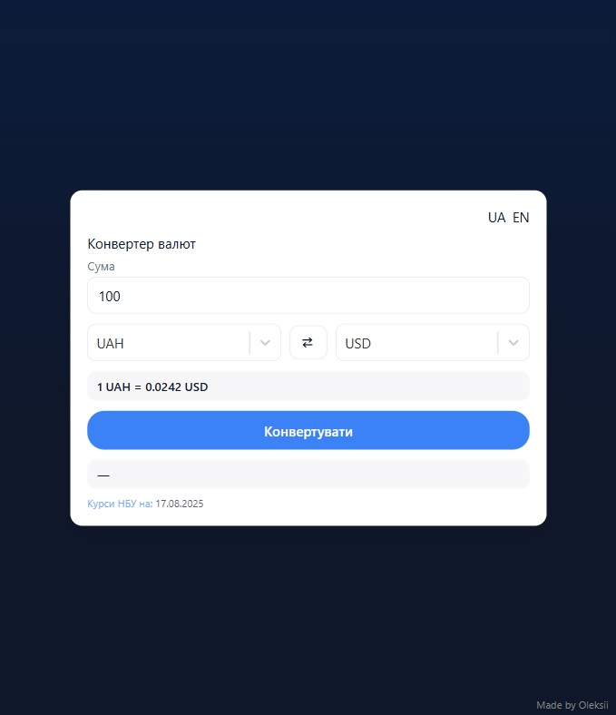

## 💱 Currency Converter

A simple and user-friendly currency converter with live exchange rates from the National Bank of Ukraine. Supports multiple languages (UA/EN) and responsive design.

## ✨ Features

- Real-time currency conversion
- Ukrainian and English language support
- Up-to-date exchange rates from NBU
- Input validation for correct values
- Responsive and clean UI

## 🛠 Tech Stack

- React + Vite
- TypeScript
- CSS Modules
- GitHub Pages (for deployment)
- NBU API


## 📸 Preview



## 🚀 Getting Started
Clone the repository and run it locally:

```bash
git clone https://github.com/kozlovoleksii/currency-converter.git
cd currency-converter
npm install
npm run dev